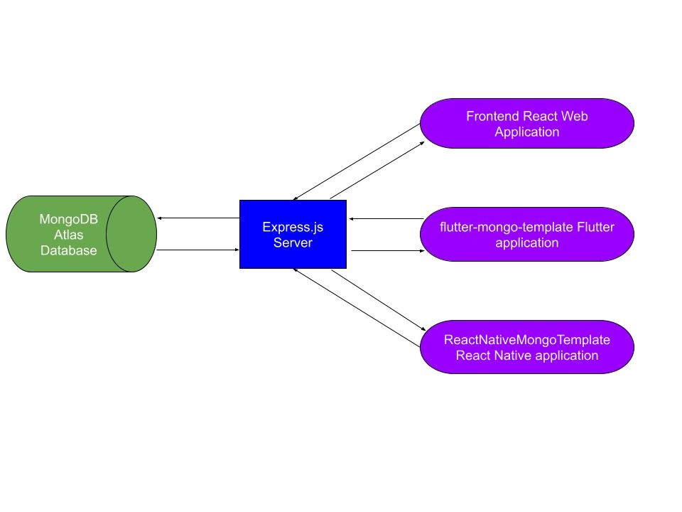
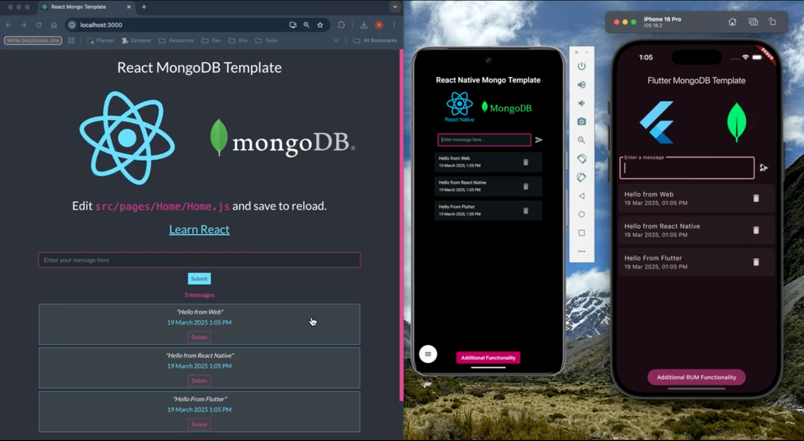

# unified-rum-sandboxes

## Overview

The purpose of this repository is to consolidate all prior sandboxes I created into a single repository. All of these sandboxes feature a MongoDB database where messages are created, read, and deleted from the database. In this `unified-rum-sandboxes` repo, all of the frontend applications (React, Flutter, & React Native) will connect to the `message-server` which will connect to the same MongoDB database:

Each frontend application is monitored with it’s respective RUM SDK and has RUM-Trace correlation enabled. All applications consist of a main view where messages are created, read, and deleted from the shared MongoDB database. There is also an additional page, allowing a second view to get created, where additional RUM functionality is added to test, learn, and demonstrate Datadog RUM:

If you're a Datadog employee you can find [documentation on this repository here](https://datadoghq.atlassian.net/wiki/spaces/TS/pages/4899275057/Educational+Unified+RUM+Sandboxes).

## What’s in the unified-rum-sandboxes repository?

At the moment, the unified-rum-sandboxes [repository](https://github.com/nick-ramsay/unified-rum-sandboxes/tree/main) contains the following applications:

### `message-server`

The message-server is the Express.js server which connects to the MongoDB database. This server is shared by all the frontend applications and handles [the CRUD operations](https://www.mongodb.com/resources/products/fundamentals/crud) executed by the sandbox applications. A link to repository can be found here, in which the `README.md` file gives instructions on installing and starting it: [unified-rum-sandboxes/message-server at main · nick-ramsay/unified-rum-sandboxes](https://github.com/nick-ramsay/unified-rum-sandboxes/tree/main/message-server) .

### `react-mongo-template`

The `react-mongo-template` repository is a [MERN application](https://www.mongodb.com/resources/languages/mern-stack) used to generate a React web application. This web application is monitored by the Browser RUM SDK. Documentation outlining how to install and start this application, with Datadog RUM monitoring enabled, can be found here: [Educational - React Browser RUM Sandbox Guide](https://datadoghq.atlassian.net/wiki/spaces/TS/pages/4877484034) .

The folder in the repository where this application resides can be found here: [unified-rum-sandboxes/react-mongo-template at main · nick-ramsay/unified-rum-sandboxes](https://github.com/nick-ramsay/unified-rum-sandboxes/tree/main/react-mongo-template) 

### `flutter-mongo-template`

The `flutter-mongo-template` repository is a Flutter application used to generate mobile applications on iOS and Android. This web application is monitored by the Flutter RUM SDK. Documentation outlining how to install and start this application, with Datadog RUM monitoring enabled, can be found here: [Educational - Flutter RUM Sandbox Guide](https://datadoghq.atlassian.net/wiki/spaces/TS/pages/4533028360). 

The folder in the repository where this application resides can be found here: [unified-rum-sandboxes/flutter-mongo-template at main · nick-ramsay/unified-rum-sandboxes](https://github.com/nick-ramsay/unified-rum-sandboxes/tree/main/flutter-mongo-template) 

### `ReactNativeMongoTemplate`

The `ReactNativeMongoTemplate` repository is a React Native application used to generate mobile applications on iOS and Android. This web application is monitored by the React Native RUM SDK. Documentation outlining how to install and start this application, with Datadog RUM monitoring enabled, can be found here: [Educational - React Native RUM Sandbox Guide](https://datadoghq.atlassian.net/wiki/spaces/TS/pages/4815781889) .

The folder in the repository where this application resides can be found here: [unified-rum-sandboxes/ReactNativeMongoTemplate at main · nick-ramsay/unified-rum-sandboxes](https://github.com/nick-ramsay/unified-rum-sandboxes/tree/main/ReactNativeMongoTemplate).

