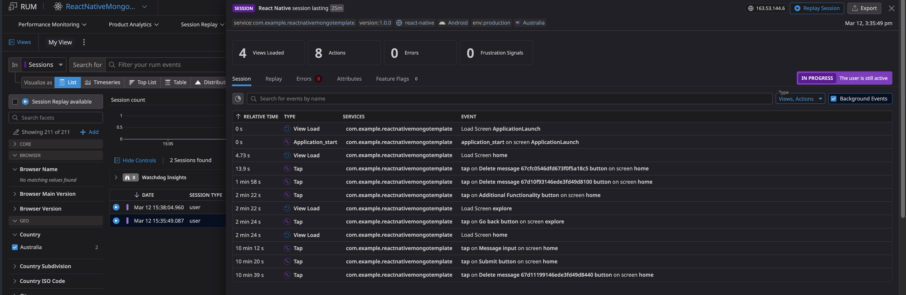

# ReactNativeMongoTemplate
## Quick Overview [TLDR]

This guide provides instructions on how to set up a React Native application monitored by the Datadog React Native RUM SDK. This guide will include the following:
- Setup an Express server to connect your React Native app to a Mongo database
- Setup your React Native app and monitor with Datadog RUM
- Explanations of how the React Native application works with RUM and the Express server

## Prerequisites

This sandbox will depend upon two separate applications, a backend server and a front-end React Native application. The prerequisites for these are the following:

### General
- Create a [GitHub](https://github.com/) account
- Install [Git](https://git-scm.com/) on your laptop
- Install a code editor on your laptop such as [Visual Studio](https://code.visualstudio.com/) or [Sublime](https://www.sublimetext.com/)

### React Native App

React Native is based, at it’s foundations, on a superset of JavaScript known as [TypeScript](https://www.typescriptlang.org/). This means that if you work with JavaScript and have the required prerequisites installed, then you likely have most of what you need to get started.

With that said, you must have Node.js installed locally on your laptop. The best way to do this is via Node Version Manager (`nvm`) : [GitHub - nvm-sh/nvm: Node Version Manager - POSIX-compliant bash script to manage multiple active node.js versions](https://github.com/nvm-sh/nvm?tab=readme-ov-file#installing-and-updating). Alternatively, you could also install Node.js and npm separately:
   1. Install Node: [Node.js — Download Node.js®](https://nodejs.org/en/download)
   2. Install Node Package Manager (`npm`): [Downloading and installing Node.js and npm | npm Docs](https://docs.npmjs.com/downloading-and-installing-node-js-and-npm)

However, in addition to JavaScript you’ll need a few more dependencies installed:
   1. [Xcode](https://developer.apple.com/xcode/) and [Android Studio](https://developer.android.com/studio) installed
   2. Installing [Cocoapods](https://guides.cocoapods.org/using/getting-started.html) for iOS development

When you complete these steps, you can run the `npx react-native doctor` command in your terminal for confirmation that you’ve installed all prerequisites:

## Setting Up and Starting React Native App

1. In the `unified-rum-sandboxes` repository, move to the `ReactNativeMongoTemplate` directory
2. Run the following command to install the necessary dependencies: `npm install`
3. Create a React Native RUM application in your Datadog org
   1. 
   2. 
4. Copy the contents of the `.env-example` file to a new file named `.env`
   1. 
5. Add `clientToken` and `applicationId` values to `.env` file in the project root directory.
   1. 
6. Run the React Native application. This can be done by simply running one of the following two commands depending upon the OS you want to use:
   1. iOS: `npx expo run:ios`
   2. Android: `npx expo run:android`

This React Native application is coded to initialise Datadog RUM on iOS and Android mobile devices and will refresh the message list every five seconds. Beyond this, if you’ve used the same Mongo database that you used when setting up this [MERN Sandbox](https://github.com/nick-ramsay/unified-rum-sandboxes/main/react-mongo-template), then you will be able to test all three using the same source of data:

As you can see from the demonstrated activity above, you should now be able to see the activity from the Android and iOS apps under your React Native RUM application:

