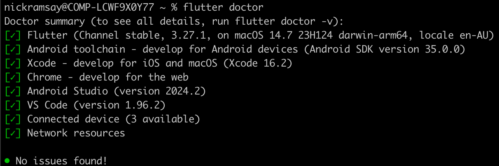

# flutter_mongo_template

## Quick Overview [TLDR]
This guide provides instructions on how to set up a Flutter application monitored by the Datadog Flutter RUM SDK. This guide will include the following:
- Setup an Express server to connect your Flutter app to a Mongo database
- Setup your Flutter app and monitor with Datadog RUM
- Explanations of how the Flutter application works with RUM and the Express server

## Prerequisites
This sandbox will depend upon two separate applications, a backend server and a front-end Flutter application. The prerequisites for these are the following:

### Both Applications
- Create a [GitHub](https://github.com/) account
- Install [Git](https://git-scm.com/) on your laptop
- Install a code editor on your laptop such as [Visual Studio](https://code.visualstudio.com/) or [Sublime](https://www.sublimetext.com/)

## Express Server
Follow the steps in the [message-server](../message-server/) directory's `readme` file. Make sure you install and start this server before starting your Flutter application.

## Flutter App
Follow the instructions at the following link to complete the prerequisites for running a Flutter application locally on your Mac: https://docs.flutter.dev/get-started/install/macos. These steps include, but aren’t limited to, the following:

1. Xcode and Android Studio installed
2. Install Visual Studio Code Editor
3. Installing Cocoapods for iOS development
4. Installing the Flutter SDK

When you complete these steps, you can run the `flutter doctor` command in your terminal for confirmation that you’ve installed all prerequisites:

## Setting Up and Starting Flutter App
1. In the same `unified-rum-sandboxes` repository, now move to the flutter-mongo-template directory
2. Run the following command to install the necessary dependencies: `flutter pub get`
3. Create a Flutter RUM application in your Datadog org
4. Copy the contents of the .env-example file to a new file named .env
5. Add clientToken and applicationId values to .env file in the project root directory.
6. Run the Flutter application. This can be done by simply running the flutter run command in the Flutter application’s root directory. However, it’s much easier with Flutter to run the application main.dart file of the Flutter application in the Visual Studio Code editor, as seen in the video below:

 
This Flutter application is coded to initialise Datadog RUM on iOS and Android mobile devices and will refresh the message list every five seconds. Beyond this, if you’ve used the same Mongo database that you used when setting up this MERN Sandbox, then you will be able to test all three using the same source of data:

As you can see from the demonstrated activity above, you should now be able to see the activity from the Android and iOS apps under your Flutter RUM application: 