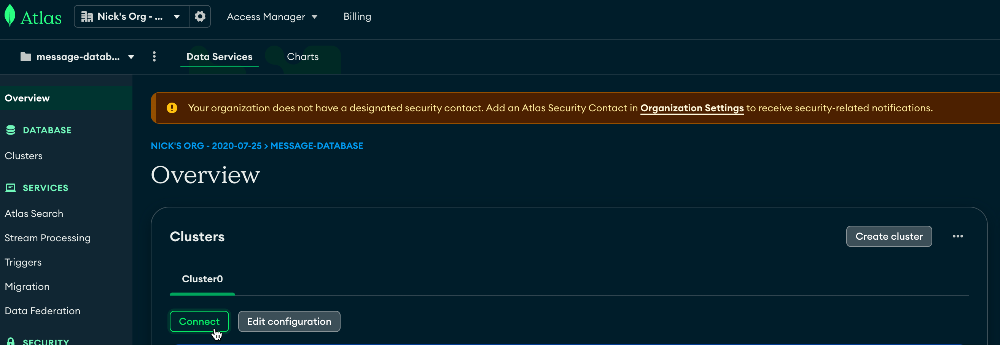
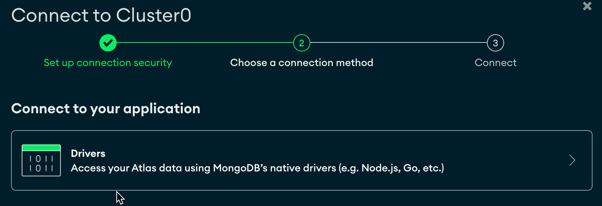
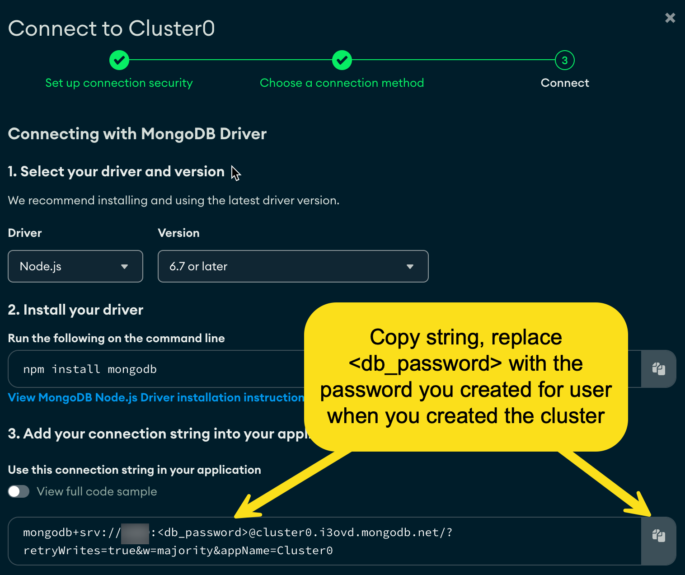
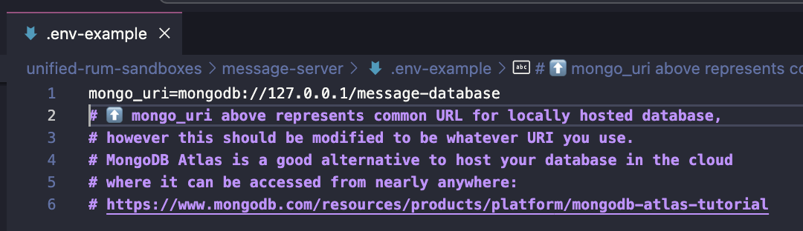
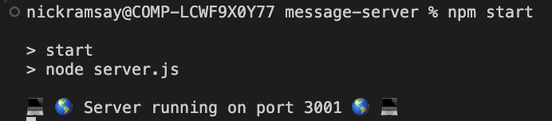

# message-server

## Introduction
This `message-server` is an API server which acts as an intermediary between the front end apps, monitored with RUM, and the MongoDB Atlas database. This is an Express.js server which is monitored with Datadog's Node.js tracer. 

## Installation and Configuration Steps
To get started with this server, please do the following:

### Option #1: Use a MongoDB Atlas Database

1. Run `npm install` command to install necessary packages
2. Create a new `.env` file by copying the content from `.env-example` into the `.env`.
2. Create a MongoDB Atlas Database and cluster. In the process, you'll create a username and password for the cluster. **_Please note down the password for the newly created user. You'll need this later and after you move on from the page you can't reveal the password again._**
3. Once you do this, get the connection string for the cluster. This can be done in the following steps:
    - Navigate to the cluster page, click `Connect`.
    
    - Next you'll be brought to a page where you see your connection options. On this page, click `Drivers`.
    
    - Now, you'll be on the `Connect to Cluster` page. Here, you'll see a connection string which you should copy.
    
5. Now that you've obtained your connection string, replace `<db_password>` in the string with the password you noted down in step two. With this change made, go to your `.env` file and update your `mongo_uri` value to the connection string value.

### Option #2: Use a Local MongoDB Database
1. Install MongoDB Community Edition on your MacBook: https://www.mongodb.com/docs/manual/tutorial/install-mongodb-on-os-x/
    a. Also consider installing [MongoDB Compass](https://www.mongodb.com/products/tools/compass) as a GUI to more easily interact with your database.
2.  Create a new `.env` file by copying the content from `.env-example` into the `.env`. The URI value already in the `.env` example, `mongodb://127.0.0.1/message-database`, should work with your local Mongo database:

## Starting the Server

1. Run `npm start`
    - If successful, you should see a confirmation that the server is running.
    
