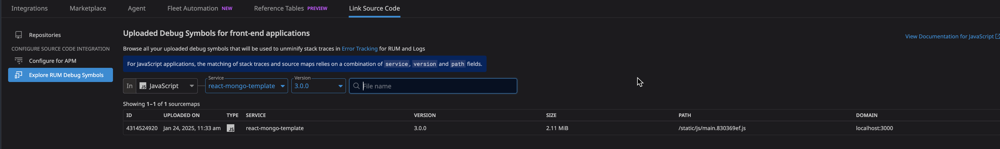
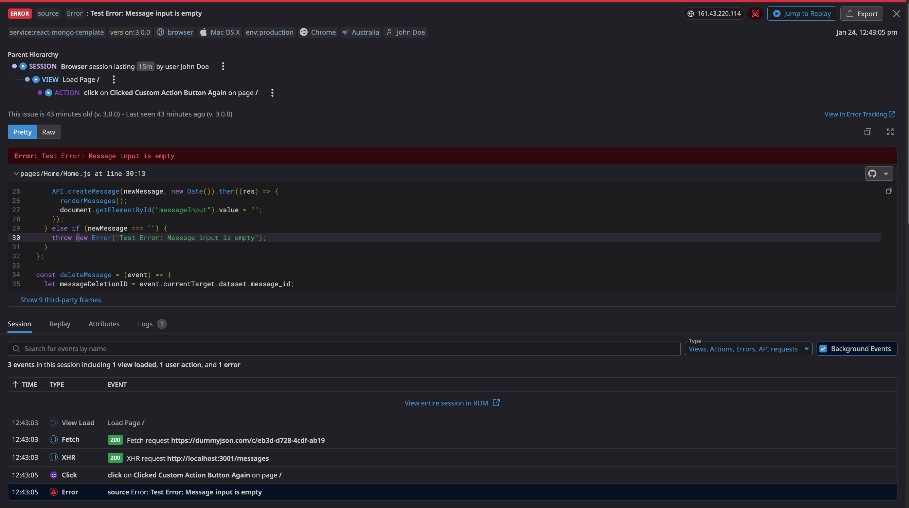

# react-mongo-template

## Overview
This directory contains a React web application which interacts with the `messages-server` to create, read, and delete messages from the MongoDB database. Some additional pieces of RUM functionality can also be tested via this application. 

## Getting Started
To get started, refer to the following steps:

1. Run `npm install` to install all necessary packages.
2. Create a new `JavaScript (JS)` RUM application in Datadog named `react-mongo-template`. Take note of the `clientToken` and `applicationId` values for this RUM application.
3. Copy the `.env-example` file to a new file named `.env`. In this file, add your `clientToken` and `applicationId` values. Also add whatever version value you want to use, for example `1.0.0`:
```
REACT_APP_RUM_APPLICATION_ID=<applicationId from Datadog RUM Application>
REACT_APP_RUM_CLIENT_TOKEN=<clientToken from Datadog RUM Application>
REACT_APP_RUM_VERSION=1.0.0
```
4. Prior to starting the `react-mongo-template` application, start up `message-server`. This will be used to handle requests between MongoDB and the front-end.
5. Now, you can start the `react-mongo-template` application. To start it locally in a `dev` mode, you can simply run `npm start`. You should be able see RUM sessions getting generated for your newly created RUM application. To run a fresh build and start the app on a `production` build, run the following command: `npm run build && npx serve -s build`. Running a `production` build and generating RUM sessions on the `production` build will allow the source maps you upload in the next step to unminify errors.
6. If you've run the `production` build, you should see a new `build` directory in the repository. This new directory contains your source maps. To upload these source maps for unminifying the stack traces, first run `npm install --save-dev @datadog/datadog-ci` to install the Datadog CI tool. Once you've done this, please reference the `dd_source_map_upload_example.txt` file:
```
export DATADOG_API_KEY=<DATADOG_API_KEY>

datadog-ci sourcemaps upload ./build/static/js \
  --service=react-mongo-template \
  --release-version=<CURRENT_VERSION_VALUE> \
  --minified-path-prefix=http://localhost:3000/static/js
```

  - You'll need to replace the `<DATADOG_API_KEY>` with your actual API key
  - Likewise, you'll need to replace the `<CURRENT_VERSION_VALUE>` with the matching `REACT_APP_RUM_VERSION` value for `production` build on which you're current generating RUM sessions.
  - ** Warning:** The `dd_source_map_upload_example.txt` file is not in the `.gitignore` file and changes will be monitored by Git. If you're planning on pushing these changes to a remote repo, such as GitHub, make sure not to push your API key to a public repo where it will get exposed.

Once uploaded, if the `service`, `version`, and `path` values match between the uploaded source maps and the stack traces you're trying to unminify, the unminification should work on your RUM Errors and Browser Logs:

[Link to Access Uploaded Source Maps in Datadog](https://app.datadoghq.com/source-code/setup/rum?search=&filters=%7B%7D&mapkind=js&page=1)



